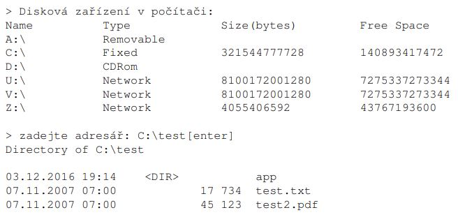

1.	Vypište seznam disků s jejich jménem, velikostí a volným místem.
2.	Uživatel zadá vstupní adresář; vypište seznam jeho adresářů a souborů s datem jejich vytvoření, velikostí(u souborů) a názvem.
 
     Náznak volání: 

     

3. Vytvořte třídu pro vhodnou reprezentaci dat ze souboru [addresses.csv](./adresses.csv). Data z tohoto souboru načtěte do kolekce těchto tříd a vypište na výstup.
4. Uživatel zadá 2 cesty. První k existujícímu adresáři, druhou libovolnou. Zkopírujte obsah prvního adresáře do druhého (včetně obsahu podadresářů). Pokud druhý adresář neexistuje vytvořte ho.

Vhodně ošetřete vstupy, výstupy, vyjimky